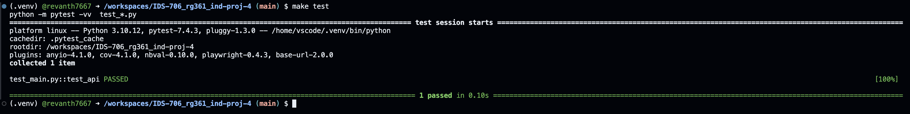
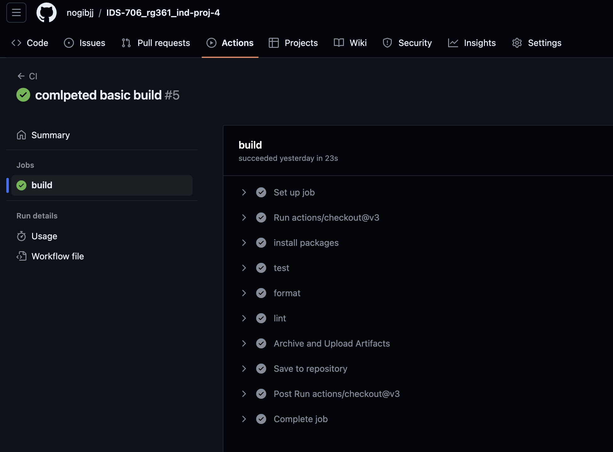

# Flask App with LLM in Azure
[](https://github.com/nogibjj/IDS-706_rg361_ind-proj-4/actions/workflows/cicd.yml)

This repository has a simple ``Flask`` app which has an ``LLM`` functionality built into it, The APP is also hosted on ``Azure`` for public access.

Link for Hosted App: [Link](https://rg361-ind4.azurewebsites.net/)

Please watch the [Youtube](https://www.youtube.com/) video for additional details and walkthrough.

# Overview
The app acts as a simple interface between the user and a [LLM Model](https://huggingface.co/grammarly/coedit-large) from HuggingFace.

The app processes the input from the user and generates a query which is passed to the LLM model via API calls.
The app then processes the response from the API and displays it to the user.

The App can be run by the user locally or can be accessed via the link provided earlier.

The app has been hosted on ``Azure Web Apps`` via a **Dockerimage hosted on DockerHub**.

## Instructions

### Setup
A. Online: Visit the Link provided earlier and no additional steps are required.
B. Offline:
   1. Clone This repository to your local machine.
   2. perform a ``make install`` to install all the required packages and libraries
   3. enter the following command into the Terminal:
      ```console
      python app.py
      ```
   5. click on the Links which are shown in the terminal

      
   6. When done using the app, press CTRL+C to quit the app

### App Usage

A. Landing Page / Main Page


The App provides Sentece Editing capabilities to the user, the app can currently perform the following actions:
1. Fluency: To correct grammatical errors in the sentence
2. Coherence: To make the sentence coherent
3. Simplification: To simplify the sentence
5. Paraphrase: To paraphrase the sentence
6. Formalize: To make the sentence sound more formal
7. Neutralize: To make the sentence sound more neutral

Once the desired option is selected from the Dropdown menu and the input text is entered, click on the ``Submit`` button

B. Result Page


The result page displays the output generated by the LLM model.

To return back to the main page and try a new sentence or operation, click on the `Go Back` button.


## Contents
The repository contains the following items:

### 1. README.md
   contains the information about the repository and instructions for using it
   
### 2. requirements.txt
   contains the list of packages and libraries which are required for running the project. These are intalled and used in the virtual environment and Github actions.
   
### 3. .github/workflows
   github actions are used to automate the following processes whenever a change is made to the files in the repository:
   - ``install`` : installs the packages and libraries mentioned in the requirements.txt
   - ``test`` : uses ``pytest`` to test the python script
      
     
   - ``format`` : uses ``black`` to format the python files
   - ``lint`` : uses ``ruff`` to lint the python files
   
     
   **Note** -if all the processes run successfully the following output will be visible in github actions:
   
   
### 4. Makefile
   contains the instructions and sequences for the processes used in github actions and .devcontainer for creating the virtual environment
   
### 5. .devcontainer
   contains the ``dockerfile`` and ``devcontainer.json`` files which are used to build and define the setting of the virtual environment (codespaces - python) for running the codes.

### 6. Data
   The CSV data file is stored here for quick access

### 7. resources 
   contains additonal files which are used in the README

### 8. Code files:
1. ``app.py`` : Contains the flask app code and the interface for the LLM Model API
2. ``test_main.py`` : Used to verify if the API connection is working

### 9. Dockerfile:
This is the dockerfile which contains intructions for the Dockerimage construction, this is for the app and is different from the dockerfile present in the .devcontainer folder

### 10. Templates
Contains the HTML files which will be used by Flask for the Landing and Result pages


   
